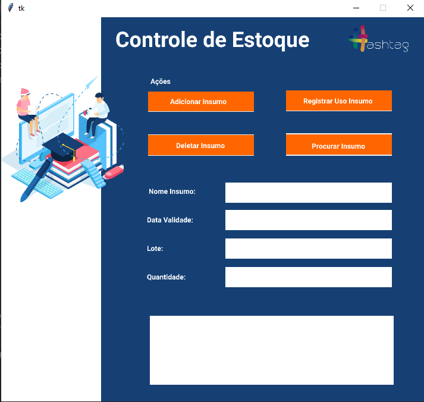

# Tkinter SQL

### Packages used:
+ tkinter
+ tkinter.messagebox
+ pyodbc

# Project Concept

This is an integration project that creates a user-friendly User Interface with Tkinter
enabling SQL database manipulation.

### Tkinter + Proxlight Designer

The following interface was created using Proxlight Designer and Figma. Proxlight imports Figma's
project and transform it into a Python Script using Tkinter.

### Python + SQL

This project utilizes pyodbc package, allowing python scripts to execute SQL commands on the database.
In this scenario we're creating the CRUD Operations (Create, Read, Update and Delete).

Create:

Read:

Update:

Delete

